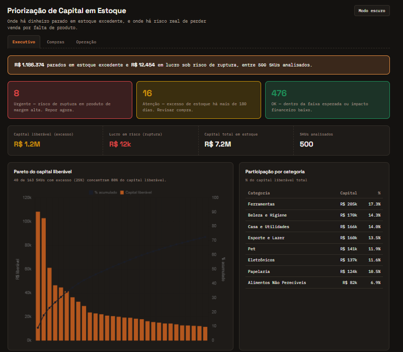

# Priorização de Capital em Estoque

A maioria dos painéis de estoque mostra o que já aconteceu. Este vai um passo além: a partir do histórico de vendas e reposição, aponta **onde há capital parado em excesso de estoque** e **onde há risco real de perder venda por ruptura** — com o valor de cada oportunidade em reais, e uma recomendação de ação, não só um gráfico bonito.

[**Demo:** https://pedrosouza88.github.io/inventory-capital-priority/index.html




## Três páginas, três públicos

| Página | Para quem | O que responde |
|---|---|---|
| **Executivo** (`index.html`) | Liderança / diretoria | Quanto capital está parado, quanto lucro está em risco, e a situação está melhorando ou piorando? |
| **Compras** (`compras.html`) | Time de compras | Qual fornecedor e qual comprador concentram o excesso? Onde a renegociação rende mais? |
| **Operação** (`operacao.html`) | Analista / operação | Catálogo completo com busca, filtros e prioridade — o que eu resolvo primeiro, hoje? |

## O que cada página mostra

**Executivo**
- Semáforo de urgência (Urgente / Atenção / OK) — prioridade de negócio, não só o diagnóstico técnico
- Pareto do capital liberável: quantos SKUs concentram 80% do dinheiro parado
- Participação de cada categoria no capital liberável total, em R$ e em %
- Tendência dos últimos 6 meses (capital parado e lucro em risco recalculados mês a mês)

**Compras**
- Capital liberável por fornecedor e por comprador responsável, com o detalhe de lucro em risco, capital investido total e contagem de SKUs

**Operação**
- Catálogo completo (500 SKUs) com busca por nome ou código, filtros por categoria, fornecedor, comprador, faixa de cobertura (0–30 / 30–90 / 90–180 / 180+ dias) e prioridade
- Ordenado por prioridade de negócio por padrão (Urgente → Atenção → OK, depois pelo valor financeiro)
- Tooltip com estoque atual, cobertura atual x alvo, margem unitária e data da última compra

## Metodologia

Para cada SKU, usando os últimos 12 meses de histórico até a data de referência:

| Métrica | Cálculo |
|---|---|
| Giro anual | vendas do período ÷ estoque médio no período |
| Dias de cobertura | estoque atual ÷ venda média diária |
| Status | "Risco de ruptura" se a cobertura é menor que o lead time de reposição; "Excesso de estoque" se a cobertura passa de 2x o alvo de segurança (2x o lead time); "Saudável" no meio termo |
| Capital liberável | unidades acima do alvo de cobertura, multiplicadas pelo custo unitário — só para SKUs com excesso |
| Lucro em risco | unidades que faltarão até a reposição chegar, multiplicadas pela margem unitária — só para SKUs com risco de ruptura |

Sobre isso, uma segunda camada de **prioridade de negócio** (diferente do status técnico acima):

| Prioridade | Condição |
|---|---|
| 🔴 Urgente | Risco de ruptura **e** margem unitária acima da mediana do catálogo — a venda perdida dói mais no lucro |
| 🟡 Atenção | Excesso de estoque com mais de 180 dias de cobertura — capital parado há tempo demais |
| 🟢 OK | O resto — inclui excesso leve e risco de baixa margem, que também importam, mas não com a mesma urgência |

A tendência de 6 meses não é um número estático: cada mês do período é recalculado como se fosse "hoje" (giro, cobertura e status refeitos com os 12 meses anteriores àquele ponto), então ela mostra a evolução real da situação, não só o instantâneo mais recente.

A ideia central: **giro alto não é sempre bom e estoque alto não é sempre ruim** — depende da relação entre os dois e do lead time de cada produto. Um SKU pode ter giro baixo por ter excesso de estoque (problema de compra) ou por ter demanda baixa mesmo (aí o problema é outro). Este painel foca no primeiro caso, que é o que dá pra agir imediatamente sobre.

## Estrutura do projeto

```
inventory-capital-priority/
├── data/
│   ├── produtos.csv           # catálogo de 500 SKUs (custo, preço, categoria, lead time, fornecedor, comprador)
│   ├── estoque_mensal.csv     # histórico de 60 meses por SKU (~30.000 linhas)
│   ├── analise_estoque.csv    # saída da análise: giro, cobertura, status, urgência, valores
│   └── tendencia_mensal.csv   # capital parado e lucro em risco recalculados nos últimos 6 meses
├── scripts/
│   ├── generate_data.py       # gera produtos.csv e estoque_mensal.csv
│   ├── analyze_inventory.py   # calcula giro, cobertura, status, urgência e tendência
│   ├── build_dashboard.py     # monta data.js e as 3 páginas em docs/
│   ├── template_executivo.html
│   ├── template_compras.html
│   ├── template_operacao.html
│   └── styles.css             # visual compartilhado pelas 3 páginas
└── docs/
    ├── index.html             # página Executivo (GitHub Pages usa esta como raiz)
    ├── compras.html
    ├── operacao.html
    ├── data.js                 # os dados das 3 páginas, gerados uma única vez
    └── styles.css
```

As 3 páginas publicadas compartilham uma única fonte de dados (`data.js`), gerada por `build_dashboard.py` — evita repetir a mesma informação três vezes e mantém tudo consistente se os dados mudarem.

## Como rodar localmente

```bash
pip install pandas numpy
python scripts/generate_data.py        # gera os CSVs em data/
python scripts/analyze_inventory.py    # gera analise_estoque.csv e tendencia_mensal.csv
python scripts/build_dashboard.py      # gera data.js e as 3 páginas em docs/
```

Depois é só abrir `docs/index.html` no navegador (os links de navegação entre as páginas funcionam localmente também).

## Limitações

Os dados são sintéticos: gerei 500 SKUs com perfis de compra propositalmente variados (parte com excesso, parte com risco de ruptura, a maioria com política razoável) para o painel ter algo relevante para mostrar. Fornecedores e compradores também são fictícios, atribuídos por categoria para simular um time de compras real. Em um cenário real, as métricas de giro e cobertura são um bom ponto de partida, mas a decisão final também depende de fatores que este painel não modela — sazonalidade específica do produto, contratos mínimos de compra com fornecedores, produtos em final de vida útil, entre outros.

O alvo de cobertura de segurança (2x o lead time) e o corte de "180 dias" para a prioridade "Atenção" são regras simples e configuráveis — em um caso real, isso normalmente varia por criticidade do produto e variabilidade da demanda (algo que métodos de estoque de segurança mais sofisticados, como os baseados em desvio-padrão da demanda, calculam de forma mais precisa).

A tendência de 6 meses mostra um pico de capital parado em novembro nesta base — reflexo de como os dados sintéticos simulam compra antecipada para a Black Friday. É um comportamento plausível (empresas de fato compram na frente de picos sazonais), mas vale checar se um padrão parecido em dados reais realmente é sazonalidade e não um problema de reposição.

## Stack

Python (pandas, numpy) para geração de dados e análise · HTML/CSS/JS puro + Chart.js para os gráficos · 3 páginas estáticas publicadas via GitHub Pages.
